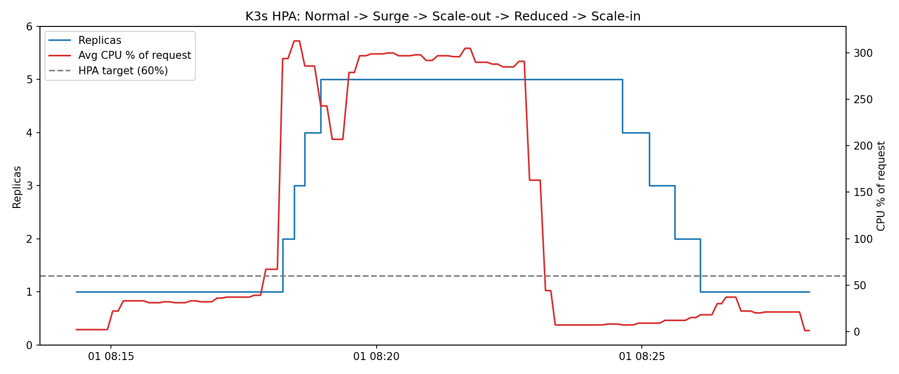

# K3s Auto Scaling & Load Testing — DevSecOps Intern Screening Assignment

Seconize Technologies — DevSecOps Intern screening submission.

This project deploys a small REST API on a single-node K3s cluster and
demonstrates automatic horizontal scaling under changing load, using only
open-source tooling: K3s, Docker, Kubernetes HPA, Apache JMeter, and Trivy.

## 1. Architecture
JMeter (load generator)
│ HTTP
▼
Traefik Ingress (built into K3s)
│
▼
Service: api (ClusterIP, port 80 → 8080)
│
▼
Deployment: api (Flask + Gunicorn, 1–5 pods)
▲
│ CPU metrics
HorizontalPodAutoscaler (target: 60% CPU utilization)


The API exposes a CPU-bound endpoint, `/api/compute`, which repeatedly
hashes data for a configurable number of iterations. JMeter drives traffic
against this endpoint in two phases (baseline + surge) to trigger scale-out
and, once the surge ends, scale-in. The Horizontal Pod Autoscaler (HPA)
watches average CPU utilization across pods (via K3s's built-in
metrics-server) and adjusts replica count between 1 and 5.

## 2. Prerequisites

- Linux (or WSL2 on Windows with Ubuntu 24.04)
- K3s (single-node)
- Docker
- Java 17+ (for JMeter)
- Apache JMeter 5.6.3
- Python 3 with `matplotlib` and `pandas` (for the evidence plot)
- Trivy (run via Docker, no separate install)

## 3. Repository layout
k3s-autoscale/
├── app/ Flask REST API + Dockerfile
├── k8s/ Namespace, Deployment, Service, HPA, Ingress, NetworkPolicy, ResourceQuota
├── jmeter/ JMeter test plan (autoscale-test.jmx)
├── scripts/ Evidence collection, plotting, and test-runner scripts
├── evidence/ Generated CSV/PNG/JMeter HTML report + Trivy scan output
├── SECURITY.md Security review and hardening applied
└── README.md This file


## 4. How to run

### 4.1 Install K3s, Docker, Java, JMeter

```bash
# Docker
sudo apt-get update
sudo apt-get install -y docker.io
sudo systemctl enable --now docker
sudo usermod -aG docker $USER && newgrp docker

# K3s (with secrets encryption enabled)
curl -sfL https://get.k3s.io | INSTALL_K3S_EXEC="server --secrets-encryption" sh -
mkdir -p ~/.kube
sudo cp /etc/rancher/k3s/k3s.yaml ~/.kube/config
sudo chown $USER:$USER ~/.kube/config && chmod 600 ~/.kube/config
export KUBECONFIG=~/.kube/config

# Java + JMeter
sudo apt-get install -y openjdk-17-jre-headless
wget https://archive.apache.org/dist/jmeter/binaries/apache-jmeter-5.6.3.tgz
tar xzf apache-jmeter-5.6.3.tgz
export PATH=$PWD/apache-jmeter-5.6.3/bin:$PATH
```

### 4.2 Build and load the application image

```bash
docker build -t autoscale-api:1.0 app/
docker save autoscale-api:1.0 | sudo k3s ctr images import -
```

### 4.3 Deploy to K3s

```bash
kubectl apply -f k8s/
kubectl -n autoscale-demo get pods,hpa
curl -s localhost/api/info
```

### 4.4 Run the load test and collect evidence

```bash
chmod +x scripts/*.sh
bash scripts/run-test.sh
```

This script:
1. Starts a background collector (`scripts/collect.sh`) that samples HPA
   and pod CPU every 5 seconds into `evidence/scaling.csv`.
2. Runs the JMeter test plan headlessly (`jmeter/autoscale-test.jmx`),
   producing `evidence/results.jtl` and an HTML report at
   `evidence/jmeter-report/index.html`.
3. Plots replica count vs. CPU utilization into `evidence/scaling.png`.

Total runtime: ~14 minutes.

### 4.5 Cleanup

```bash
kubectl delete namespace autoscale-demo
sudo /usr/local/bin/k3s-uninstall.sh
```

## 5. Scaling design

| Decision | Rationale |
|---|---|
| CPU-based HPA metric | Simplest, most reliable signal to demonstrate with a stateless API; no extra metrics pipeline (e.g. custom Prometheus adapter) required. |
| Target: 60% average CPU utilization | Leaves headroom above baseline (~30–50% under normal load) so scale-out triggers clearly during the surge, without being so low that it scales on noise. |
| `minReplicas: 1`, `maxReplicas: 5` | Keeps the demo's resource footprint small while still showing a multi-step scale-out (1→3→5) under the JMeter surge. |
| Scale-up: no stabilization delay, +2 pods/30s | Reacts quickly to load spikes — matches the "increased load → automatic scale-out" requirement. |
| Scale-down: 90s stabilization, −1 pod/30s | Long enough to avoid flapping if load is jittery, short enough to observe scale-in within the assignment's timeline (default Kubernetes behavior is a 5-minute window). |
| CPU-bound `/api/compute` endpoint | Produces a clean, reproducible load signal for JMeter to drive and for the HPA to react to. |

## 6. Load test phases

| Time | Phase | JMeter threads |
|---|---|---|
| 0–3 min | Normal load | 2 (baseline) |
| 3–8 min | Increased load → automatic scale-out | 2 (baseline) + 30 (surge) |
| 8–13 min | Reduced load → automatic scale-in | 2 (baseline only) |

## 7. Results



The chart shows replica count (left axis) rising from 1 to 5 as CPU
utilization (right axis) exceeds the 60% HPA target during the surge phase,
then replicas scaling back down to 1 once load drops and the 90-second
stabilization window elapses.

Full JMeter HTML report: `evidence/jmeter-report/index.html`
Raw scaling samples: `evidence/scaling.csv`

## 8. Security review

See [SECURITY.md](SECURITY.md) for the full findings table, Trivy scan
output, and hardening measures implemented (Pod Security Admission
`restricted`, non-root/read-only containers, dropped capabilities,
default-deny NetworkPolicy, ResourceQuota/LimitRange, K3s secrets
encryption, and more).

## 9. Demo video

(https://github.com/Aswankrishnan/k3s-autoscale/blob/main/demo.mp4) — shows the full Normal → Increased → Scale-out →
Reduced → Scale-in cycle, with `kubectl get hpa,pods` visible throughout.

## 10. Reproducibility

This setup was verified end-to-end on a clean K3s installation using only
the commands in this README and the manifests in `k8s/`. To re-verify:

```bash
kubectl delete namespace autoscale-demo
kubectl apply -f k8s/
bash scripts/run-test.sh
```
